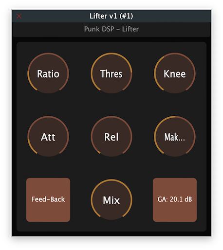

# Lifter
A JUCE audio plugin to showcase the behaviour of the lifter model in my module: punk_dsp

[](https://github.com/gmoican/Lifter/actions/workflows/build.yml)



## Introduction
This is a VST3/AU compressor plugin made with [JUCE](https://juce.com/). The sole purpose of this plugin is to showcase and test the performance of my `Lifter` class in [punk_dsp](https://github.com/gmoican/punk_dsp).

## Features

The `Lifter` class uses the following logic for applying dynamic processing:
1. Identify sidechain - _feed-back_ or _feed-forward_ topology determine how this is done.
2. Measure sidechain.
3. Compute gain addition.
4. Apply gain addition.

All classes have methods for updating the following parameters:
- Ratio.
- Threshold (in decibels).
- Knee (in decibels).
- Attack and release times (in miliseconds).
- Make-up gain (in decibels).
- Mix (in percentage).
- Feed-back / feed-forward topology.

Furthermore, there is a `getGainAddition` method meant to be used in the GUI for displaying the current gain addition.

## Usage examples

```cpp
// --- PluginProcessor.h ---
#include "punk_dsp/punk_dsp.h"

class PluginProcessor : public juce::AudioProcessor
{
public:
    /* Your processor public stuff
     * ...
     */
private:
    /* Your processor private stuff
     * ...
     */
    punk_dsp::Lifter lifter;
};

// --- PluginProcessor.cpp ---
void PluginProcessor::prepareToPlay(double sampleRate, int samplesPerBlock)
{
    juce::dsp::ProcessSpec spec;
    spec.maximumBlockSize = samplesPerBlock;
    spec.numChannels = getTotalNumOutputChannels();
    spec.sampleRate = sampleRate;

    lifter.prepare( spec );

    // Your code...
}

void PluginProcessor::updateParameters()
{
    // Examples
    lifter.updateThres(-30.f);
    lifter.updateRatio(6.f);
    lifter.updateMix(90.f);

    // Your code...
}

void PunkOTTProcessor::processBlock (juce::AudioBuffer<float>& buffer)
{
    lifter.process(buffer);
}
```

## Plugins that make use of this compressor
* [PunkOTT](https://github.com/gmoican/PunkOTT) and [PunkOTT-MB](https://github.com/gmoican/PunkOTT-MB), my take on OTT-style processors.

